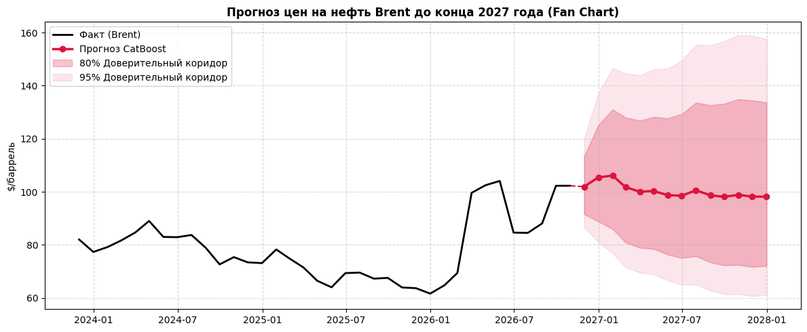
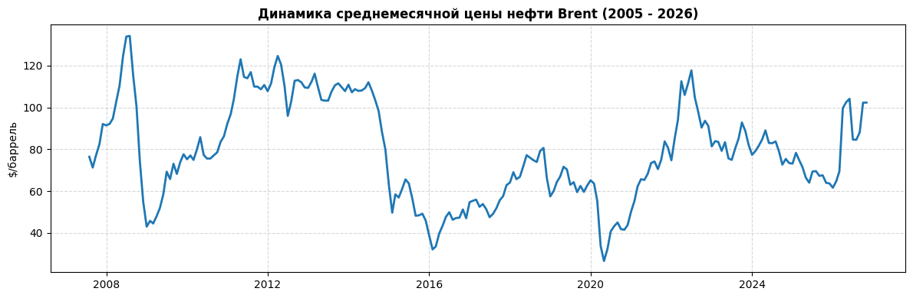

# Прогнозирование цен на нефть Brent до конца 2027 года

[](https://www.python.org/)
[](https://catboost.ai/)
[](https://www.statsmodels.org/)
[](https://scikit-learn.org/)
[](LICENSE)

Многофакторное среднесрочное прогнозирование цен на нефть марки **Brent** до конца 2027 года на основе рыночных и макроэкономических факторов (WTI, DXY, S&P 500) с использованием прямого многошагового градиентного бустинга (*Direct Multi-Step CatBoost*).

---

## 📈 Финальный прогноз (Fan Chart)



* **Среднегодовая прогнозная цена на 2027 год:** **$99.83 / баррель**.
* **Динамика:** стабилизация в диапазоне **$98 – $101 / баррель** к концу 2027 года (эффект возврата к фундаментальному среднему).

### Прогноз по месяцам

| Месяц | Прогноз Brent ($/барр.) | Нижняя 80% | Верхняя 80% | Нижняя 95% | Верхняя 95% |
| :---: | :---: | :---: | :---: | :---: | :---: |
| **2026-11** | **101.91** | 91.56 | 113.43 | 86.49 | 120.07 |
| **2026-12** | **105.43** | 88.79 | 125.19 | 81.05 | 137.15 |
| **2027-01** | **106.12** | 85.92 | 131.05 | 76.81 | 146.60 |
| **2027-02** | **101.74** | 80.86 | 128.01 | 71.57 | 144.63 |
| **2027-03** | **100.03** | 78.89 | 126.84 | 69.54 | 143.90 |
| **2027-04** | **100.28** | 78.43 | 128.21 | 68.84 | 146.09 |
| **2027-05** | **98.71**  | 76.30 | 127.70 | 66.55 | 146.42 |
| **2027-06** | **98.54**  | 75.06 | 129.36 | 64.95 | 149.49 |
| **2027-07** | **100.56** | 75.69 | 133.60 | 65.08 | 155.36 |
| **2027-08** | **98.68**  | 73.41 | 132.64 | 62.74 | 155.21 |
| **2027-09** | **98.10**  | 72.26 | 133.19 | 61.42 | 156.68 |
| **2027-10** | **98.85**  | 72.44 | 134.88 | 61.41 | 159.10 |
| **2027-11** | **98.19**  | 71.71 | 134.44 | 60.69 | 158.87 |
| **2027-12** | **98.15**  | 72.03 | 133.73 | 61.11 | 157.62 |

---

## ⚖️ Сравнение моделей (Бэктестинг на 14 месяцев)

| Модель | RMSE ($) | MAE ($) | MAPE (%) | Skill Score vs Naive |
| :--- | :---: | :---: | :---: | :---: |
| **0. Naive (Random Walk / No-Change)** | 22.66 | 17.66 | 18.75% | 0.00% |
| **1. SARIMAX(1,1,1)** | 23.01 | 17.88 | 18.94% | -1.54% |
| **2. Scaled Ridge (L2)** | 23.78 | 18.42 | 19.78% | -4.94% |
| **3. CatBoost (Direct Multi-Step)** 🏆 | **18.15** | **14.21** | **15.02%** | **+19.90%** |

CatBoost превзошел базовый финансовый бенчмарк на **+19.9%** за счет прямого горизонта прогнозирования без накопления рекурсивной ошибки авторегрессии.

---

## 🛠 Данные и признаки

Данные с 2005 по 2026 гг. с месячной агрегацией (`resample('ME').mean()`):
1. **`dev_ma36`**: отклонение логарифма цены от 3-летней скользящей средней (моделирует цикл возврата к фундаментальному среднему).
2. **`spread_clean`**: очищенный спред Brent – WTI (баланс логистики и регионального спроса/предложения).
3. **`dxy_ret_3m`**: 3-месячный темп прироста индекса доллара DXY (давление долларовой ликвидности).
4. **`vol_12m`**: 12-месячная историческая волатильность доходностей (премия за риск).



---

## 🚀 Быстрый старт

```bash
# 1. Клонирование
git clone https://github.com/Metrahol/brent-oil-forecast.git
cd brent-oil-forecast

# 2. Установка зависимостей
pip install -r requirements.txt

# 3. Запуск ноутбука
jupyter notebook brent_oil_forecast.ipynb
```

## 📁 Структура

```text
├── brent_oil_forecast.ipynb         # Основной Jupyter Notebook с анализом и моделями
├── requirements.txt                 # Зависимости
├── .gitignore                       # Игнорируемые файлы
├── README.md                        # Описание проекта
└── assets/                          # Графики
    ├── brent_forecast_fan_chart.png
    └── brent_historical.png
```
